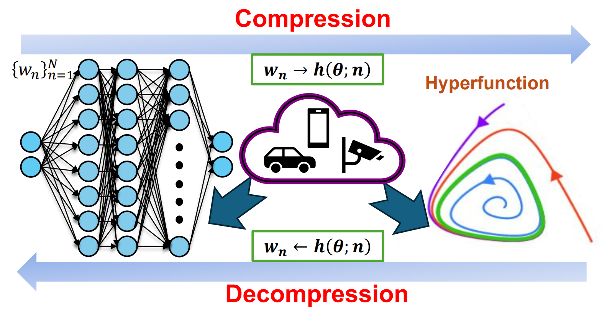

## 《Hyper-Compression: Model Compression via Hyperfunction》

   

[📄[paper](https://arxiv.org/pdf/2409.00592)] [📍[Github](https://github.com/Juntongkuki/Hyper-Compression)]

The **hyper-compression** uses a **hyperfunction** to represent the parameters of the target network, and notably, here the hyperfunction is designed per ergodic theory that relates to a problem: if a low-dimensional dynamic system can fill the high-dimensional space eventually.

<div align="center">
  
</div>


### 💡The proposed hyper-compression enjoys the following merits: 

* **P**referable compression ratio 

* **N**o post-hoc retraining

* **A**ffordable inference time

* **S**hort compression time


## Contents

* Abstract
* How to Use
* Experiments Results
* Citation


## Abstract

The rapid growth of large models' size has far outpaced that of GPU memory. To bridge this gap, inspired by the succinct relationship between genotype and phenotype, we turn the model compression problem into the issue of parameter representation to propose the so-called hyper-compression. The hyper-compression uses a hyperfunction to represent the parameters of the target network, and notably, here the hyperfunction is designed per ergodic theory that relates to a problem: if a low-dimensional dynamic system can fill the high-dimensional space eventually. Empirically, the proposed hyper-compression enjoys the following merits: 1) **P**referable compression ratio; 2) **N**o post-hoc retraining; 3) **A**ffordable inference time; and 4) **S**hort compression time. It compresses LLaMA2-7B in an hour and achieves close-to-int4-quantization performance, without retraining and with a performance drop of less than 1%. Our work has the potential to invigorate the field of model compression, towards a harmony between the scaling law and the stagnation of hardware upgradation.


## How to Use

#### 1. How to compress models:

We provide examples of compressing three models: UNet, MobileNetV3, and Sheared-LlaMA-1.3B. Of course, our method can be applied to any model, as it essentially compresses the model's parameters and is independent of the model structure. The models for UNet and MobileNetV3, along with the project files, are available and can be run directly, with the compression results automatically saved in the newly created `compressed_results` folder. However, due to the large size of the Sheared-LlaMA-1.3B model, we recommend downloading it directly from Huggingface and placing all model files in `Hyper-Compression/Sheared-Llamma-hyper-compression/Sheared-LlaMA-1.3B/`.


#### 2. How to test compressed models:

In our paper, we conducted multiple tests on the three models—UNet, MobileNetV3, and Sheared-LlaMA-1.3B—to demonstrate that our compression method has minimal impact on model performance.

* UNet is tested on the Carvana dataset using the Dice metric. You can run `Hyper-Compression/UNet-hyper-compression/decode_eval.py` to evaluate it.

* MobileNetV3 is tested on the CIFAR-10 dataset using Accuracy. You can run `Hyper-Compression/MobileNetV3-hyper-compression/decode_eval.py` to evaluate it.

* Sheared-LlaMA-1.3B is tested on the  [wikitext-2-raw-v1](https://huggingface.co/datasets/Salesforce/wikitext) dataset for Perplexity (PPL) and evaluated on eight downstream tasks: 0-shot accuracy on SciQ, WinoGrande, ARC-E, 25-shot ARC-C, 10-shot HellaSwag, 32-shot BoolQ, NQ, and 5-shot MMLU, using the `lm-evaluation-harness` GitHub library. However, to perform the 8 downstream tasks, you need to download [`lm-evaluation-harness`](https://github.com/EleutherAI/lm-evaluation-harness.git) :

  ```bash
  git clone https://github.com/EleutherAI/lm-evaluation-harness.git
  cd lm-evaluation-harness
  pip install -e .
  ```

  For example, assuming I want to test 10-shot HellaSwag on [Sheared-LlaMA-1.3B](https://huggingface.co/princeton-nlp/Sheared-LLaMA-1.3B), we can use the following command:

  ```bash
  lm_eval --model hf --model_args pretrained=/root/autodl-tmp/LLM-models/Sheared-LLaMA-1.3B --tasks hellaswag --device cuda:0 --batch_size auto:4 --num_fewshot 10
  ```

  When we want to test the lossy model compressed using our method, we only need to replace the `pytorch_model.bin` in the `Hyper-Compression/Sheared-Llamma-hyper-compression/Sheared-LLaMA-1.3B/` folder with `pytorch_model_back.bin` from `Hyper-Compression/Sheared-Llamma-hyper-compression/compressed_result/`. (When replacing, remember to also rename the file to "pytorch_model.bin"). This way, you can perform the test using the same method.

  

  At the same time, we can use the following code to test the model's Perplexity (PPL). The [wikitext-2-raw-v1](https://huggingface.co/datasets/Salesforce/wikitext) dataset can be downloaded from Hugging Face:

  ```python
  import torch
  import torch.nn as nn
  from transformers import AutoTokenizer, AutoModelForCausalLM
  import tqdm
  from datasets import load_dataset
  import argparse
  
  class Evaluator:
      def __init__(self, dataset, tokenizer, device, n_samples=40):
          self.dataset = dataset
          self.tokenizer = tokenizer
          self.device = device
  
          self.dataset = tokenizer(
              "\n\n".join(dataset['train']["text"]), return_tensors="pt"
          ).input_ids.to(device)
  
          self.n_samples = n_samples
  
      @torch.no_grad()
      def evaluate(self, model):
          model.eval()
          nlls = []
          n_samples = self.n_samples if self.n_samples else self.dataset.size(1) // 2048
          for i in tqdm.tqdm(range(n_samples), desc="Evaluating..."):
              batch = self.dataset[:, (i * 2048) : ((i + 1) * 2048)].to(model.device)
              with torch.no_grad():
                  lm_logits = model(batch).logits
              shift_logits = lm_logits[:, :-1, :].contiguous().float()
              shift_labels = self.dataset[:, (i * 2048) : ((i + 1) * 2048)][:, 1:]
              loss_fct = nn.CrossEntropyLoss()
              loss = loss_fct(
                  shift_logits.view(-1, shift_logits.size(-1)), shift_labels.view(-1)
              )
              neg_log_likelihood = loss.float() * 2048
              nlls.append(neg_log_likelihood)
  
          return torch.exp(torch.stack(nlls).sum() / (n_samples * 2048))
  
  
  
  # dataset = load_dataset("wikitext", "wikitext-2-raw-v1", split="test")
  dataset = load_dataset('parquet', data_files='wiki2-test-00000-of-00001.parquet')
  
  tokenizer = AutoTokenizer.from_pretrained("`Hyper-Compression/Sheared-Llamma-hyper-compression/Sheared-LLaMA-1.3B")
  model = AutoModelForCausalLM.from_pretrained("`Hyper-Compression/Sheared-Llamma-hyper-compression/Sheared-LLaMA-1.3B").to('cuda')
  
  evaluator = Evaluator(dataset, tokenizer, "cuda", n_samples=n_samples)
  ppl = evaluator.evaluate(model)
  print(f"Perplexity: {ppl}")
  ```

  

### 3. How to use compressed results for model inference:

We only provide the example for UNet, and you can run `Hyper-Compression/UNet-hyper-compression/inference.py`.


## Experiments Results

This table is the comparison of our methods with other compression variant models of LlaMA2-7B on eight downstream tasks: 0-shot accuracy on SciQ, WinoGrande, ARC-E, 25-shot ARC-C, 10-shot HellaSwag, 32-shot BoolQ, NQ, and 5-shot MMLU. "Average" means the average of these downstream tasks . As a reference, the compression ratio of INT4 quantization is 4×. The comparison of Perplexity (PPL) is tested on the dataset [wikitext-2-raw-v1](https://huggingface.co/datasets/Salesforce/wikitext).

|                            Model                             | File Size (GB) |  Average (%)   | Perplexity (PPL) |
| :----------------------------------------------------------: | :------------: | :------------: | :--------------: |
| [LlaMA2-7B]([https://huggingface.co/meta-llama/Llama-2-7b-hf) |     12.50      |     65.88      |       5.19       |
| [Sheared-LlaMA-1.3B](https://huggingface.co/princeton-nlp/Sheared-LLaMA-1.3B) |  5.01 (2.50×)  | 50.31 (-15.57) |   7.76 (+2.57)   |
| [TinyLlaMA](https://huggingface.co/TinyLlama/TinyLlama_v1.1) |  4.09 (3.06×)  | 51.53 (-14.35) |   7.32 (+2.13)   |
|  [LiteLlaMA](https://huggingface.co/ahxt/LiteLlama-460M-1T)  | 0.86 (14.53×)  | 40.41 (-25.47) |  20.22 (+15.03)  |
|                        LlaMA2-7B + HF                        |  4.80 (2.60×)  | 64.89 (-0.99)  |   5.48 (+0.29)   |
|                   Sheared-LlaMA-1.3B + HF                    | 0.98 (12.76×)  | 49.76 (-16.12) |   7.99 (+2.80)   |
|                        TinyLlaMA + HF                        | 0.78 (16.03×)  | 50.65 (-15.23) |   7.54 (+2.35)   |
|                        LiteLlaMA + HF                        | 0.39 (32.05×)  | 39.72 (-26.16) |  23.89 (+18.70)  |


As for UNet and MobileNetV3, our method can compress UNet and Pruned-UNet by 7.93× and 7.10× with the performance loss contained in 1%. Particularly, our method succeeds in combination with other model compression methods such as pruning to achieve an even higher compression ratio. In UNet, the total compression ratio is 17.87× with the performance loss 3.41%.

|    Model     |   File Size (MB)   |        Dice (%)        |
| :----------: | :----------------: | :--------------------: |
|     UNet     |       51.10        |         99.86          |
|   Pruning    |   20.30 (2.53×)    |     96.34 (-3.52)      |
|      HF      |    6.45 (7.93×)    |     99.71 (-0.15)      |
| Pruning + HF |   2.86 (17.87×)    |     96.45 (-3.41)      |
|  **Model**   | **File Size (MB)** | **Top-1 Accuracy (%)** |
| MobileNetV3  |        5.95        |         74.41          |
|   Pruning    |    2.22 (2.68×)    |     69.32 (-5.09)      |
|      HF      |    1.18 (5.04×)    |     73.93 (-0.48)      |
| Pruning + HF |   0.43 (13.84×)    |     68.47 (-5.94)      |


## Citation

If you want to cite this paper, please cite it in your publications.

```bibtex
@article{fan2024hyper,
  title={Hyper-Compression: Model Compression via Hyperfunction},
  author={Fan, Fenglei and Fan, Juntong and Wang, Dayang and Zhang, Jingbo and Dong, Zelin and Zhang, Shijun and Wang, Ge and Zeng, Tieyong},
  journal={arXiv preprint arXiv:2409.00592},
  year={2024}
}
```


